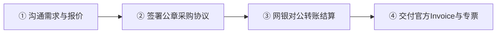

<div align="center">

# AI 代采 (aidaicai.com)
### 企业级海外 AI 官方代采 · 阶梯量采降本 · 对公财税合规结算平台

[](https://www.aidaicai.com)
[](https://www.aidaicai.com)
[](https://www.aidaicai.com)
[](https://www.aidaicai.com)
[](https://www.aidaicai.com)

<br/>

> **专为出海机构、跨境电商、产研技术团队及大中型企业打造的 OpenAI / ChatGPT 全系官方直采服务。**  
> 彻底打破海外支付风控与企业报销合规壁垒，**实行透明阶梯让利机制（采购量越大单价越低）**，全流程支持**企业银行对公结算、开具 6% 增值税专用发票、签署加盖公章法律协议**。

</div>

---

## 📱 【商务直通】专属大客户经理联系方式

无论您需要 **1 个账号体验** 还是 **数百人研发团队批量集采**，我们均为您配备专属 1v1 大客户经理，**10 分钟内响应出具公章合同与阶梯采购报价单**。

<div align="center">
<table>
  <tr>
    <td align="center" width="340" valign="top">
      <br/>
      
      <br/><br/>
      <b>💼 企微官方实名商户认证</b><br/>
      <sub>认证主体：<b>成都游手科技有限公司</b></sub><br/>
      <sub>微信扫一扫 · 10分钟内出具公章合同</sub><br/>
      <sub>支持网银公对公 · 6% 数电专票抵扣</sub>
      <br/><br/>
    </td>
    <td align="center" width="340" valign="top">
      <br/>
      
      <br/><br/>
      <b>👔 大客户总监直通专线</b><br/>
      <sub>微信号：<code>yqtp01</code>（点击选中即可复制）</sub><br/>
      <sub>7×24H 实时在线 · 专属企业技术方案解答</sub><br/>
      <sub>支持直接添加个人微信沟通定制需求</sub>
      <br/><br/>
    </td>
  </tr>
</table>

**商务沟通直达**：微信添加 `yqtp01` ｜ 官方邮箱：`biz@aidaicai.com` ｜ 官方服务门户：[www.aidaicai.com](https://www.aidaicai.com)

</div>

---

## 🌟 为什么选择 AI 代采？四大核心合规交付支柱

| 核心维度 | 传统个人代充 / 某宝电商 / 虚拟卡买U | AI 代采（aidaicai.com）企业官方服务 |
| :--- | :--- | :--- |
| **资金与结算方式** | 员工个人信用卡垫资 / 私人微信支付宝 / 采购虚拟币（买U），涉嫌资金外逃风控 | **100% 走中国工商银行对公转账**，正规企业银行结算回单，满足企业财务内审与反洗钱监管要求 |
| **发票与财务报销** | 无法提供发票，或提供假发票、走壳公司开杂项发票，存在巨大税务稽查风险 | **开具国家税务局 6% 增值税专用发票 / 普通发票**（类目：信息技术服务费），一般纳税人可直接进项抵扣 |
| **卡段来源与风控** | 乱用高危虚拟卡段、黑卡刷盗刷、批量并发，极易被 OpenAI 官方溯源封号且无法申诉 | **100% 采用正规海外商业银行实体企业卡直充**，提供带官方扣款流水号与卡号后四位的原版 Invoice 凭单 |
| **售后保障与赔付** | 店铺频繁换皮，封号后卖家失联或推诿；“包月”往往几天失效 | **签署加盖公章的正式《SLA 服务保障协议》**：提供 **72 小时闪电保换号** 与 **按天折算极速退款** 兜底机制 |
| **企业采购立项阻力** | 无正规材料，采购向管理层、财务、法务汇报难度极大 | **免费提供全套《企业采购立项申请呈批模板》与合规协议**，采购经理填入公司名称即可直接提交过审 |

---

## 🎯 企业采购全系产品矩阵

我们提供 OpenAI / ChatGPT 官方全规格订阅服务，适配企业不同业务场景与算力配额需求：

```
                    ┌─── [基础办公] ChatGPT Plus ($20/月) ─── 跨境文案、翻译、客服运营、日常助理
                    │
AI 代采产品矩阵 ────┼─── [研发攻坚] ChatGPT Pro (5x - $100/月) ── 1M 上下文、长程深度推理、资深研发代码辅助
                    │
                    ├─── [满血旗舰] ChatGPT Pro (20x - $200/月) ─ 20倍极限算力、Computer Operator 电脑操控
                    │
                    └─── [企业空间] ChatGPT Team ($30/人/月) ──── 独立工作空间、数据隔离不参与训练、统一权限后台
```

### 1. 核心产品版本参数一览

| 产品版本 | 官方美元价 | 核心算力与权限亮点 | 适用企业角色 |
| :--- | :---: | :--- | :--- |
| **ChatGPT Plus** | $20 / 月 | • 优先接入 **GPT-6 Astra** 与 **GPT-5.6** 智能路由<br>• 高峰期免排队稳定访问网络<br>• 高级数据分析 (Python) 与多模态生图 | 跨境文案主笔、日常翻译、海外客服专员、一般管理岗 |
| **ChatGPT Pro (5x)** | $100 / 月 | • 5倍 Plus 级 **GPT-6 Astra / GPT-5.6** 调用配额上限<br>• 支持 **100 万 (1M Token)** 超长上下文记忆与并行分析<br>• Deep Research 科研级深度行业调研 | 资深文案策划、独立站站长、核心研发工程师、数据分析师 |
| **ChatGPT Pro (20x 旗舰版)** | $200 / 月 | • **搭载 OpenAI 满血旗舰 GPT-6 Astra**<br>• **20 倍海量配额 / 极限算力与超高并发优先级**<br>• 突破性 **Computer Operator** 电脑操控智能体<br>• 复杂架构设计、高难度数学攻坚与代码审计 | 算法科学家、架构总监、技术 CTO、前沿 AI 实验室团队 |
| **ChatGPT Team 空间** | $30 / 人 / 月<br>(起订 2 人) | • 全员享有 **GPT-6 Astra** 与 **GPT-5.6** 前沿算力<br>• 企业独立数据隔离工作空间（**默认不用于模型训练**）<br>• 企业管理员后台（统一调配席位、移除离职员工）<br>• 共享企业专属 GPTs 与内部知识库工作流 | 需统一权限管理的中大型研发团队、跨国项目组、高保密机构 |

---

## 💰 企业批量采购阶梯报价方案 (含税与对公)

> *价格包含：官方订阅美金成本 + 海外合规结算通道损耗 + 6% 增值税专用发票税费 + 专属大客户 1v1 运维保障。*  
> **机制原则**：采购规模越大、签约周期越长，综合单价越低。

### 阶梯价格速查表 (RMB / 席位 / 含税对公)

| 规格类型 | 采购规模 | 月度采购价 | 季度采购优惠价 (季付) | 年度采购极客价 (年付) | 附赠企业增值权益包 |
| :--- | :---: | :---: | :---: | :---: | :---: |
| **ChatGPT Plus** | 1 ~ 4 个 | ¥ 165 / 个 / 月 | ¥ 155 / 个 / 月 | **¥ 145 / 个 / 月** | 等值 ¥ 10 / 席位 / 月 |
| (主流推荐) | 5 ~ 19 个 | ¥ 155 / 个 / 月 | ¥ 145 / 个 / 月 | **¥ 135 / 个 / 月** | 等值 ¥ 15 / 席位 / 月 |
| | 20 个及以上 | ¥ 145 / 个 / 月 | ¥ 135 / 个 / 月 | **¥ 125 / 个 / 月** | 详询大客户总监专属定制方案 |
| **ChatGPT Pro (5x)** | 1 ~ 4 个 | ¥ 790 / 个 / 月 | ¥ 740 / 个 / 月 | **¥ 690 / 个 / 月** | 等值 ¥ 40 / 席位 / 月 |
| (进阶研发) | 5 ~ 19 个 | ¥ 740 / 个 / 月 | ¥ 690 / 个 / 月 | **¥ 640 / 个 / 月** | 等值 ¥ 60 / 席位 / 月 |
| | 20 个及以上 | ¥ 690 / 个 / 月 | ¥ 640 / 个 / 月 | **¥ 590 / 个 / 月** | 详询大客户总监专属定制方案 |
| **ChatGPT Pro (20x)** | 1 ~ 2 个 | ¥ 1,580 / 个 / 月 | ¥ 1,480 / 个 / 月 | **¥ 1,380 / 个 / 月** | 等值 ¥ 80 / 席位 / 月 |
| (满血旗舰) | 3 ~ 9 个 | ¥ 1,480 / 个 / 月 | ¥ 1,390 / 个 / 月 | **¥ 1,290 / 个 / 月** | 等值 ¥ 120 / 席位 / 月 |
| | 10 个及以上 | ¥ 1,380 / 个 / 月 | ¥ 1,290 / 个 / 月 | **¥ 1,190 / 个 / 月** | 详询大客户总监专属定制方案 |

*注：ChatGPT Team 企业空间支持按需定制席位数，详情请添加大客户微信 `yqtp01` 获取定制方案。*

---

## ⚡ 极速对公采购履约流程 (标准 4 步法)



1. **第 1 步：沟通需求与选型**（扫码添加大客户经理微信，说明公司名称、所需版本与席位数量，获取正式报价单）。
2. **第 2 步：签署公章合作协议**（支持飞书电子签、e 签宝或双方加盖公章寄送《企业软件代采购框架协议》与《SLA 保障条款》）。
3. **第 3 步：企业银行对公打款**（通过企业网上银行直接公对公转账至我司对公账户，正规安全，财务有账可查）。
4. **第 4 步：极速交付与票据送达**（技术团队 10~30 分钟内完成官方订阅交付；交付官方原版带卡号 Invoice，开具 6% 增值税发票，支持顺丰寄达）。

---

## 📂 企业采购立项与合规物料库 (直接使用)

为协助采购经理及技术负责人快速通过公司内部合规审批与财务内审，我们在本项目 `docs/` 目录中整理了全套现成实战物料，**点击即可查阅与下载使用**：

* 📄 [《企业采购立项申请报告呈批模板》(采购直接向领导与财务呈批)](docs/business/procurement-proposal-template.md)
* 📊 [《官方阶梯代采报价单与折算模型》(详细成本效益分析)](docs/business/pricing-matrix.md)
* ⚖️ [《企业软件代采购框架合作协议》(法务现成公章合同文本)](docs/legal/enterprise-service-agreement.md)
* 🛡️ [《SLA 服务等级与 72h 封号退赔保障条款》(官方赔付责任细则)](docs/legal/sla-guarantee-terms.md)
* 🎁 [《战略集采增值权益与先锋引荐人激励规范》(合规履约SOP)](docs/operations/procurement-rewards-policy.md)

---

## 🏛️ 企业官方资质与对公结算账户公示

| 项目 | 官方核验信息 |
| :--- | :--- |
| **签约实体** | 成都游手科技有限公司 |
| **统一社会信用代码** | 经得起反洗钱核验与企查查穿透审查 |
| **开户银行** | 中国工商银行股份有限公司成都武侯大道支行 |
| **银行对公账号** | `1001 2488 0910 0088 820` |
| **汇款用途 / 附言** | `技术服务费` 或 `软件代采款` |
| **发票开具类目** | `*信息技术服务* 软件技术服务费`（增值税普通发票 / 专用发票，税率 6%） |
| **官方线上服务域名** | [https://www.aidaicai.com](https://www.aidaicai.com) |

---

<details>
<summary><b>🛠️ 开发者技术附录：本地部署与项目架构说明（点击展开）</b></summary>

<br/>

本项目同时也是 **AI 代采官方现代化官方站点（aidaicai.com）** 的开源代码仓库，基于 **Next.js 15 (App Router) + Tailwind CSS + TypeScript** 构建，拥有极客级暗黑毛玻璃美学与极致响应速度。

### 1. 项目目录结构

```text
d:\dev\aidaicai/
├── docs/                                    # 【商务物料与法务合规知识库】
│   ├── business/                            # 采购立项模板与阶梯报价单
│   ├── legal/                               # 合作框架协议与 SLA 兜底条款
│   └── operations/                          # 增值权益履约合规 SOP
├── public/                                  # 静态资源与认证二维码
│   └── images/
│       ├── 企业微信二维码.jpg                # 官方企微商户认证码
│       └── 微信二维码.webp                  # 大客户总监直通微信码
├── src/                                     # 【Next.js 现代化企业官网源码】
│   ├── app/
│   │   ├── layout.tsx                       # 全局 SEO、Viewport、品牌底座
│   │   ├── page.tsx                         # 落地页核心组件装配
│   │   └── globals.css                      # 高级暗黑视觉设计系统与令牌
│   └── components/
│       ├── Navbar.tsx                       # 品牌顶栏导航
│       ├── HeroSection.tsx                  # 视觉首屏与信任徽章
│       ├── PainPointsCompare.tsx            # 痛点对比矩阵
│       ├── ProductCatalog.tsx               # Plus / Pro / Team 产品矩阵
│       ├── PricingCalculator.tsx            # 实时阶梯代采计算器
│       ├── ComplianceShowcase.tsx           # 真实凭据样张展示
│       ├── ContactModal.tsx                 # 企微与微信直通弹窗
│       └── Footer.tsx                       # 页脚与合规免责声明
```

### 2. 本地运行指南

```bash
# 1. 安装依赖包
npm install

# 2. 启动本地开发服务
npm run dev

# 3. 浏览器访问测试
# 打开 http://localhost:3000
```

</details>

---

<div align="center">

**💼 立即开启企业合规海外 AI 采买通道**  
添加大客户经理微信：`yqtp01` ｜ 官网：[www.aidaicai.com](https://www.aidaicai.com)  
*Copyright © 2026 AI 代采 (aidaicai.com) · 成都游手科技有限公司 · 版权所有*

</div>
