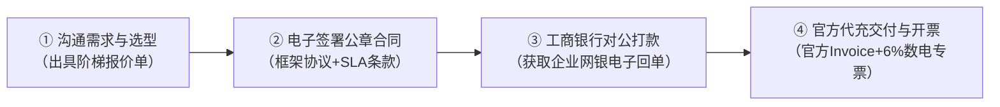

# 【知乎爆款专栏】软件公司给研发批量采购 ChatGPT，如何做到对公结算、开 6% 专票且 100% 避免封号？（附立项呈批模板）

> **作者推荐标题备选**（发布时可根据目标受众选择）：
> * **【采购/IT视角】**：别再让程序员用私人卡垫资了！软件公司批量采购 ChatGPT 的全套合规落地 SOP（避坑实录）
> * **【财务/合规视角】**：研发团队要报销 ChatGPT 费用？财务总监必须警惕的 3 大税务与资金合规地雷
> * **【CTO/技术管理视角】**：全团队配齐满血版 ChatGPT 后研发效能翻倍？聊聊我们团队从“野路子代充”到“正规企业对公代采”的转型

---

## 导语：一次差点引发部门“火拼”的报销风波

上个月底，我们技术部发生了一件啼笑皆非、却又让行政和财务极度头疼的事：

为了赶出海独立站和底层核心服务的重构上线，技术总监给核心组的 15 个研发工程师统一下令，必须用上 **ChatGPT Pro（深度推理与长上下文版）** 和 **ChatGPT Plus** 来辅助写代码、Debug 和架构审查。

程序员们的执行力确实强，但难题在月底报销时爆发了——

15 个人各显神通：有人刷了自己的个人双币信用卡；有人因为自己的外币卡被 OpenAI 风控拒付，跑去某宝找店铺代充；还有人图省事，托朋友在境外买虚拟币（买 U）充值……

结果报销单交到财务总监桌上，财务总监脸都绿了：
* “这打印出来的英文 PDF 收据（Receipt）根本不是国家税务发票，怎么平账？”
* “这个代充店铺开的是‘办公用品’通用假发票，进项税查验都过不了，被税务稽查算谁的？”
* “员工私人垫资几万块，公司如果直接打到私人账户，资金用途如何向审计交代？”

更要命的是，还没等报销走完流程，**其中 4 个在某宝代充的研发账号一夜之间全被 OpenAI 官方给封了！** 辛辛苦苦调优了一个月的 Prompt 提示词工程、知识库上下文和代码历史记录，全部灰飞烟灭。研发在群里痛骂，采购夹在中间左右为难，财务坚决不予签字……

相信很多软件互联网公司、出海技术团队，甚至跨国制造企业的 IT 和采购专员，对这个场景绝对不陌生。

今天我就结合我们团队踩过的血泪教训，彻底把**“软件企业如何合规采购海外大模型/ChatGPT”**这件事讲透：从内幕风险拆解，到标准采购考核指标，再到可以直接拿去向老板呈批的立项落地 SOP。

---

## 一、 为什么国内软件公司给团队买 GPT 会这么难？

很多没接触过海外软件采买的同行可能会疑惑：不就是买个软件会员吗，直接官网绑定信用卡买不就行了？

对企业级场景来说，这件事横跨了**外汇、财税、内控、风控**四大关卡：

### 1. 支付与外汇壁垒（国内卡频频被拒）
OpenAI 官方只接受海外部分国家的合法信用卡或企业结算方式，国内发行的普通 Visa/MasterCard 双币卡拒付率极高（防欺诈风控规则极度苛刻）。研发人员往往试了三四张卡，不仅没绑上，反而导致账号和 IP 被列入高风险黑名单。

### 2. 财税发票死结（财务无票无法做账）
OpenAI 是纯境外 SaaS 机构，结算走美金，给的只是一张海外标准的消费 Receipt。
* 根据中国税法，企业所得税税前扣除需要合规凭证；
* 企业如果想在研发费用中据实列支、甚至享受**“研发费用加计扣除”**政策，必须取得国家税务局认证的增值税发票；
* 员工私人垫资、个人账户往来，在如今的数电发票与金税四期穿透监管下，极其容易触发财务合规风控。

### 3. “野路子”代充的连环暴雷隐患
走投无路时，很多公司会默许采购去某宝、某鱼或找熟人代充，但这里面的水深不见底：
* **黑卡与盗刷卡**：很多黑产利用海外被盗信用卡（CC）或批量低成本虚拟卡刷单，一旦原卡主向银行拒付（Chargeback），OpenAI 会直接封锁账号，且同一卡段绑定的连带账号全部株连；
* **店铺跑路无售后**：卖家声称“质保 30 天”，往往用了两周店铺就注销换皮了，售后无门；
* **买 U（虚拟币）涉罪风险**：个别代充机构要求通过虚拟币结算，严重违背企业外汇与反洗钱监管红线，企业财务碰都不能碰。

---

## 二、 企业级采购海外 AI 工具，必须坚守的“4 大合规铁律”

经过那次报销风波后，我们公司管理层达成了一致：**宁可多花一点合规成本，也坚决不碰任何个人代充与野路子。**

为此，我们 IT 采购、财务、法务三方联合，制定了企业级代采供应商的 **4 个硬性准入标准**（同行采购朋友可以直接抄作业）：

```
                       ┌─── ① 资金链路：100% 走银行网银对公结算，出具公对公打款回单
                       │
企业合规采购 4 大铁律 ──┼─── ② 财税合规：开具国家税务局认证 6% 增值税专用发票（信息技术服务费）
                       │
                       ├─── ③ 卡段与凭证：100% 海外正规实体商业银行卡，交付官方带流水号 Invoice
                       │
                       └─── ④ 兜底保障：签署加盖公章正式合同与 SLA，承诺封号按天折算极速退款
```

### 铁律 1：资金链路必须 100% 阳光透明（对公转账）
杜绝任何微信私账、支付宝私账、个人信用卡转账。
供应商必须是国内正规注册的企业法人主体，支持通过**中国工商银行等国内主流商业银行网银公对公转账**，汇款附言明确为“技术服务费”或“软件代采款”，资金流向清晰，经得起第三方审计与内审穿透。

### 铁律 2：必须提供 6% 增值税专用发票，且开票类目精准
发票类目必须是合规的 `*信息技术服务* 软件技术服务费` 或 `技术服务费`。
作为一般纳税人的软件研发企业，拿到 6% 的数电专票后，**可以直接用于进项税额抵扣**，抵扣后的实际采购成本大幅降低，同时研发费用可以正大光明计入成本账目。

### 铁律 3：卡段必须正规，交付官方原版带卡号 Invoice
拒绝批量虚拟卡池。供应商代充必须使用其正规海外分支机构或海外商业银行实体企业卡。
更关键的一点：**交付时必须能够同步提供 OpenAI 官方发出的原版英文 Invoice PDF 凭证**，凭证上必须清晰印有官方订单编号、扣款金额以及付款卡号后四位。这样万一遇到官方误封，可以凭原始凭据官方申诉解除。

### 铁律 4：必须有加盖公章的正式协议与 SLA 退赔兜底
口头承诺“包月”一文不值。必须签署正式加盖公章的《企业软件代采购框架合作协议》以及《SLA 服务保障条款》。
明确约定：若因支付卡段或官方系统波动出现异常封号，服务商必须在 **72 小时内完成换号补齐**，或**严格按当月未使用天数折算、极速原路对公退款**。

---

## 三、 我们最终跑通的解决方案与经济账拆解

按照上述标准在市场上筛了一圈，我们最终锁定了专注做企业出海 AI 官方代采的专业服务商——**【AI 代采】（官网：[www.gongsi.one](https://www.gongsi.one)）**。

其运营主体是国内正规认证的高新企业（成都游手好闲科技有限公司），全套履约流程完全踩中了我们财务和法务的所有要求。

### 1. 它是怎么彻底解决我们团队痛点的？

* **企微实名商户认证**：对接人全部是企业微信实名认证的大客户经理，10 分钟内就能给出带公章的报价单和合规合同；
* **纯正对公与专票**：直接走中国工商银行对公打款，隔天就通过全国统一电子发票服务平台开出了 **6% 增值税专用发票（信息技术服务费）**，财务秒过审；
* **正规卡段与原版 Invoice**：充值完成后，后台直接交付 OpenAI 官方原版 Invoice，卡号可查，安全感拉满；
* **SLA 兜底承诺**：合同里明文写明 72 小时封号包赔和按天折算退款，采购不用再提心吊胆背锅。

### 2. 算一笔明白账：阶梯量采到底能省多少钱？

很多采购人以为“找对公合规代采肯定比自己买贵很多”，其实完全相反！
因为像这类专业企业服务商拥有**规模化海外清算通道与阶梯采购配额**，采购量越大，单价反而越便宜。

他们官方公布的阶梯采购价格参考如下（注意最后一列）：

| 规格类型 | 采购规模 | 官方折算价 | 阶梯季度采购价 | 年度极客采购价 | 附赠专属商务礼遇包（团队/经办） |
| :--- | :---: | :---: | :---: | :---: | :---: |
| **ChatGPT Plus** | 1 ~ 4 个 | ¥ 165 / 月 | ¥ 155 / 个 / 月 | ¥ 145 / 个 / 月 | 等值 ¥ 10 / 席位 / 月 |
| (主流研发标配) | 5 ~ 19 个 | ¥ 165 / 月 | **¥ 145 / 个 / 月** | **¥ 135 / 个 / 月** | **等值 ¥ 15 ~ 20 / 席位 / 月（支持主流电商卡券）** |
| | 20 个及以上 | ¥ 165 / 月 | **¥ 135 / 个 / 月** | **¥ 125 / 个 / 月** | **★ 详询大客户总监专属定制方案（享弹性商务空间）** |
| **ChatGPT Pro (5x)**| 1 ~ 4 个 | ¥ 800 / 月 | ¥ 740 / 个 / 月 | ¥ 690 / 个 / 月 | 等值 ¥ 40 / 席位 / 月 |
| (架构深度推理) | 5 ~ 19 个 | ¥ 800 / 月 | **¥ 690 / 个 / 月** | **¥ 640 / 个 / 月** | **等值 ¥ 60 ~ 80 / 席位 / 月（支持主流电商卡券）** |
| | 20 个及以上 | ¥ 800 / 月 | **¥ 640 / 个 / 月** | **¥ 590 / 个 / 月** | **★ 详询大客户总监专属定制方案（享弹性商务空间）** |

以我们软件团队实际采购的配置为例（15 个 Plus 账号 + 3 个 Pro 深度攻坚账号）：

| 产品规格 | 团队角色配比 | 官方单价（美金折算及手续费） | AI 代采阶梯季度优惠价 | 增值税专票抵扣 (6%) | 单月综合净成本 |
| :--- | :--- | :---: | :---: | :---: | :---: |
| **ChatGPT Plus** | 15 个（前端/后端/测试/文案） | 约 ¥ 165 ~ 170 / 月 | **¥ 145 / 个 / 月** | 可抵扣进项税 ~¥8.2 | **约 ¥ 136.8 / 个** |
| **ChatGPT Pro (5x)** | 3 个（架构总监/算法专家） | 约 ¥ 800 ~ 820 / 月 | **¥ 690 / 个 / 月** | 可抵扣进项税 ~¥39.0 | **约 ¥ 651.0 / 个** |

**综合经济效益总结**：
1. **直接降本**：通过阶梯量采季付方案，单账号综合采购成本比员工零散折腾汇率手续费便宜了 **15% 以上**；
2. **税费抵扣**：6% 增值税专票直接冲抵销项税，相当于整体支出再省一笔；
3. **隐性工时节约**：彻底免去了 18 个人每个月折腾梯子、换卡、找假发票报销所消耗的几十个小时高薪工时，研发开箱即用，把精力 100% 投入在代码开发上。

---

## 四、 极速对公采购履约全流程（实操 4 步走）

整个采购流程非常顺畅，前后不到 1 个工作日就全部开通完毕：



1. **第 1 步：沟通需求与选型**  
   直接微信添加他们的大客户经理，告知公司需要开通的账号数量和规格（比如 15 个 Plus，3 个 Pro 5x），对方 10 分钟内就会出具正规的《阶梯采购正式报价单》。
2. **第 2 步：电子签署公章合同**  
   支持使用 e 签宝、飞书电子签或双方加盖公章寄送纸质合同。法务重点审核《企业软件代采购框架协议》和《SLA 服务保障协议》，权责边界清晰。
3. **第 3 步：企业银行网银对公打款**  
   财务直接在企业网银后台向指定的对公账户转账（户名：成都游手好闲科技有限公司，开户行：中国工商银行股份有限公司成都武侯大道支行）。
4. **第 4 步：极速交付与票据送达**  
   款项到账后，技术团队在 20 分钟内完成所有官方账号的订阅激活，交付带卡号后四位的官方原版 Invoice，增值税专票直接推送到财务邮箱，顺畅完成闭环。

---

## 五、 给同行采购与 IT 负责人的福利赠送

很多做采购、行政或 IT 的朋友最怕的不是找供应商，而是**“怎么写内部立项呈批报告”**——如何说服部门总监、财务总监和总经理批准这笔预算。

我们当时为了通过这套立项，内部改了三版，把**业务必要性、供应商比选模型、预算测算表、数据隐私与风控兜底**全部做成了标准模块。

现在我们把这份经过实战检验、已经顺利过审的**《企业采购 OpenAI 生产力账号立项申请报告（完整呈批模板）》**分享出来，大家可以直接套用：

> ### 🎁 免费福利包内容包含：
> 1. 📄 **《企业采购立项申请报告呈批模板.docx》**（填入公司名称和人数即可直接呈批上报）
> 2. 📊 **《官方阶梯代采报价与 ROI 降本测算模型.xlsx》**（自动计算不同人数与纳税人抵扣后的净成本）
> 3. ⚖️ **《企业软件代采购框架合作协议（公章范本）》**（免去法务从头起草的烦恼）
> 4. 🛡️ **《SLA 服务等级保障与 72 小时封号退赔细则》**

**获取方式非常简单**：
1. 🌐 **在线自助下载**：可直接访问官方知识库门户查阅并下载全套物料：**[www.gongsi.one](https://www.gongsi.one)**
2. 💬 **站内互动直发**：需要 Word/Excel 完整源文件的朋友，直接在**本篇评论区留言【立项】**或**点击作者头像【发送私信】**，我看到后逐一私信发您；
3. 💼 **大客户商务直通**：如需 10 分钟内出具加盖公章的《正式采购报价单》，或针对 5 人以上集采咨询《专属经办人商务关怀方案》，欢迎**查看作者个人主页置顶简介**直通大客户经理。

---

## 结语：让专业的人做专业的事

AI 时代，研发团队的工具链升级已经不是“要不要配”的问题，而是“能不能比竞争对手更快配齐、更稳使用”的生死问题。

作为采购或 IT 部门，我们要做的不是用私人卡去打游击、碰运气，而是**通过成熟阳光的对公渠道，帮公司建立一条合法合规、有发票抵扣、有 SLA 退赔兜底的高效通道**。

希望这篇实操复盘能帮助正在为海外软件报销和代充头疼的采购与财务同行少走弯路。如果有任何关于海外 SaaS 采购、对公结算或发票抵扣的细节疑问，欢迎在评论区交流！

---
*(本文为作者团队企业软件采购真实复盘，涉及商业信息均已做脱敏处理。)*
